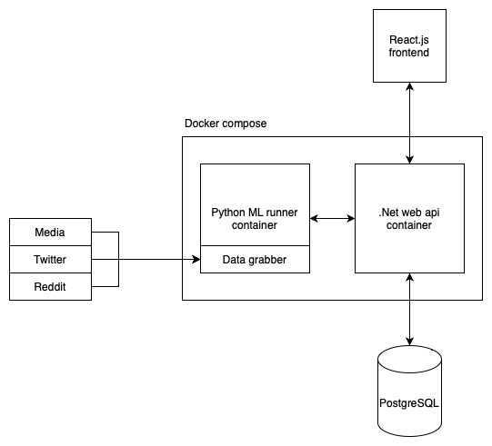

# mktrends - web app that uses algorithms and ML models to analyze news from various sources

## Algorithms
### Clustering and summarizing news
Using unsupervized clustering algorithms (DBSCAN) paired with summarization algorithms (LSA) to create clusters with a short summary of the news [medium.com](https://medium.com/@danilo.najkov/using-clustering-and-summarization-algorithms-for-news-aggregation-eb16a891c479)
### Detecting political bias
Detecting potential bias in the news (left or right) using deep learning models [medium.com](https://medium.com/@danilo.najkov/detecting-political-bias-in-online-articles-using-nlp-and-classification-models-c1a40ec3989b) 
### Detect and analyze trends with sentiment analysis
Detecting what topics are popular in longer periods of time and analyzing the sentiment behind them

## Solution architecture

## Sources
- 38 media outlets
- Twitter 
- Reddit
